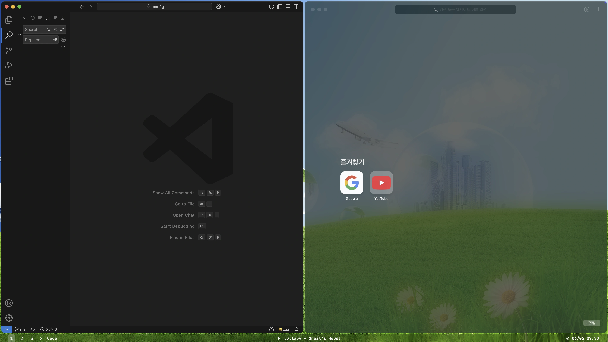

# dotfiles

A collection of my simple macOS dotfiles

## Applications I Use
* [yabai](https://github.com/koekeishiya/yabai) - A tiling window manager for macOS based on binary space partitioning
* [skhd](https://github.com/koekeishiya/skhd) - Simple hotkey daemon for macOS (using for yabai)
* [SketchyBar](https://github.com/FelixKratz/SketchyBar) - A highly customizable macOS status bar replacement
* [fish](https://github.com/fish-shell/fish-shell) - I love fish 🤤
* [micro](https://github.com/zyedidia/micro) - I can't use vim 😭
